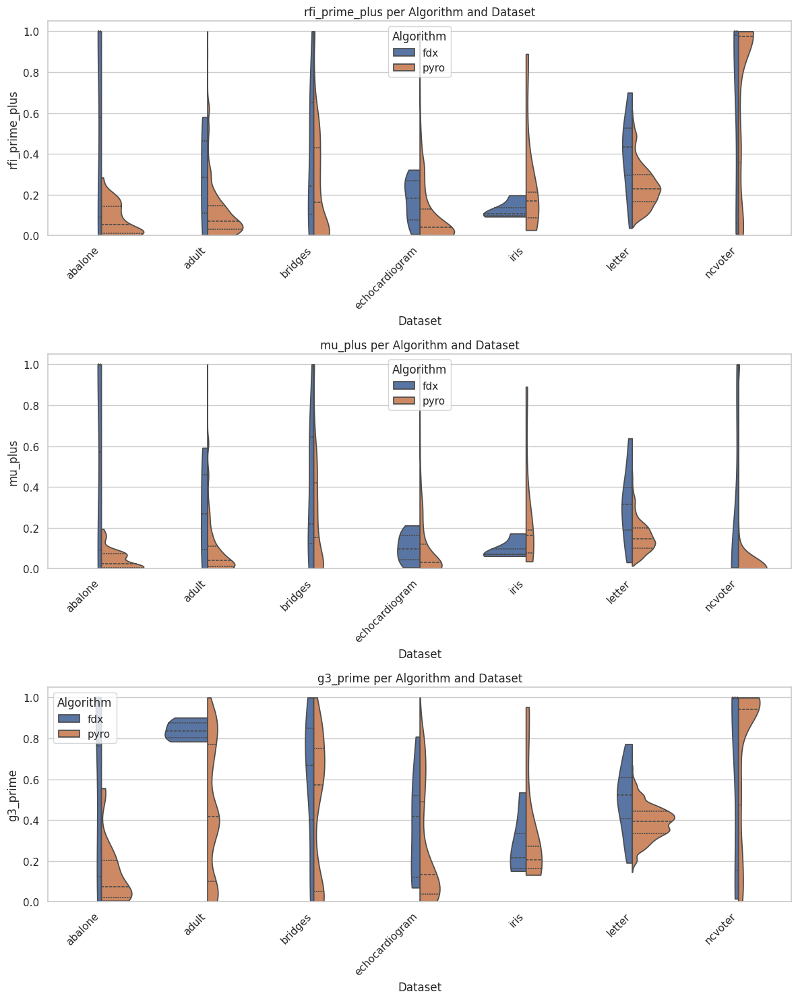

# TCC

## Visualizations

## Project Structure

The project is organized as follows:

- **profiler/**: Contains FDX source code.
  - **results/**: Stores the output of profiling tasks.
- **src/**: Contains scripts for metrics and plotting.
  - **metrics/**: Scripts for calculating metrics.
  - **plots/**: Scripts for generating plots.  
- **metanome-cli/**: Contains scripts and configurations for running Metanome CLI.
  - **run.sh**: Bash script to execute algorithms Pyro and HyFD on datasets.
  - **usage.txt**: Documentation for running Metanome CLI with different algorithms and configurations.
- **datasets/**: Contains datasets used for experiments.
  - **experiments/**: Subfolder with CSV files for testing algorithms.

## How to run experiments

### Prerequisites
- Python 3.x
  - Python libraries:
    - pandas
    - matplotlib
    - seaborn
    - numpy
    - scikit-learn
- Java 8 or higher

1. Go to the `metanome-cli` directory.
2. Run the `run.sh` script: This will execute the HyFD and Pyro algorithms on the datasets in the `datasets/experiments` directory.
   - The script will generate output files in the `metanome-cli/results/` directory.
   - There is more information about the usage of the script in `metanome-cli/usage.txt`.
3. Go to the profiler directory.
4. Go to the `src/metrics` directory.
5. Run the `run.sh` script: This will execute the `metrics.py` script to calculate metrics for the results generated by the Metanome CLI and profiller.
    - The script will generate output files in the `metrics_results/` directory.
6. (optional) Go to the `src/plots` directory and run `run.sh` to generate plots for data that are stored in `src/metrics/metrics_results`.
7. (optional) Create a new directory in `experiments`with the timestamp of the experiment and copy the results from `metrics_results` to the new directory.

#### Obs:
- You can add/remove datasets in the `datasets/experiments` directory to test different datasets.